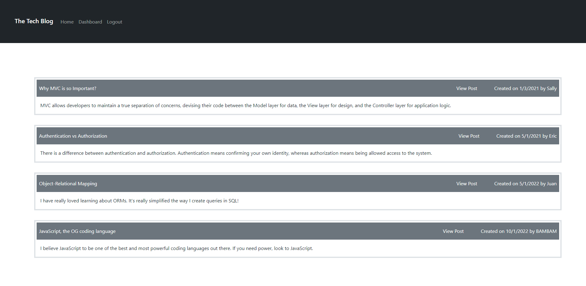

# Tech-Blog

## Description
This project was created to demonstrate my ability to use the MVC model. Using technologies such as Sequelize, Handlebars, Express, Dotenv and others, you will be able to navigate a Tech Blog with articles and comments that relate to interesting points of views and discussions. Create a user, add posts, comment on other posts, and follow the world of Web Development in a easy to use and simple process. Deployed using Heroku, the back end will store all information in a mySQL database. 

## Screenshot

## Deployed Application
https://protected-tundra-33047.herokuapp.com/
